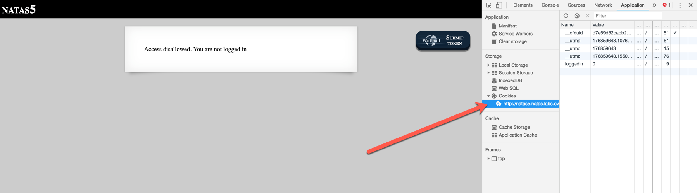

# Natas 5 Solution

A common way of persisting authentication state (keeping a user logged in when the page is reloaded)
is using [cookies](https://www.w3schools.com/js/js_cookies.asp).

In Inspect Element, you can view and edit cookies under the Application tab.
Alternatively, you could edit cookies using JavaScript.

Notice that there is a `loggedin` cookie. We can change this to `1` (Double click on the current value of the cookie, `0`, and press enter to save once you type the new value) 
and reload the page to get the password.

**Username: natas6**  
**Password: aGoY4q2Dc6MgDq4oL4YtoKtyAg9PeHa1**
